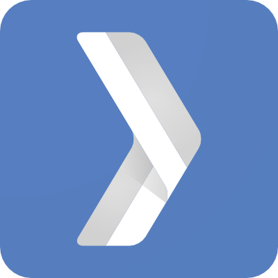

# GDG Legon CodeLab

This repository contains resources that would be useful to anyone interested in learning about `html`, `css`, `git` and `angular`. 
 
We will cover : 

- An introduction to [git](./git-basics/intro.md)
- An intro to [web development basics](./web-basics/README.md)
- dive deeper into angular with a [simple todo app](./demo-app/README.md)
