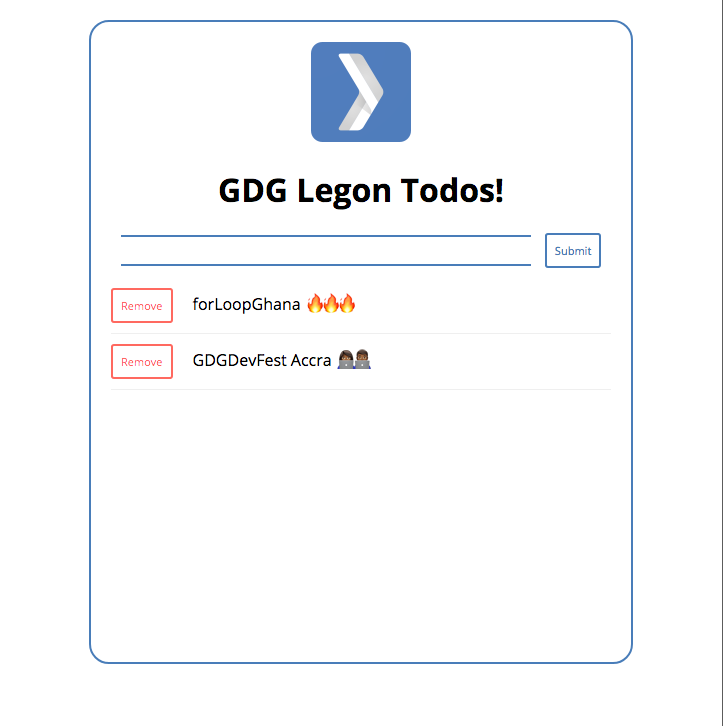

# GDG Legon TodoApp



<br />

Simple TODO App made with [Angular](https://angular.io/) for CodeLab ❤️ &nbsp; hosted with  by [GDGLegon](https://www.meetup.com/GDG-Legon/events/244773353/)

## Setup
To set things up on your local machine, it is assumed you have [Node](https://nodejs.org) and [NPM](https://npmjs.com).Once your installation is confirmed you may continue.

### Clone Repository
```sh
git clone https://github.com/GDGLegon/code-lab.git
```

### Install Project Dependencies
```sh
cd code-lab/demo-app
npm install
```

### Run App
To run the app enter the following command :
```sh
ng serve --open
```
Head to `localhost:4200` to see todo app at work
